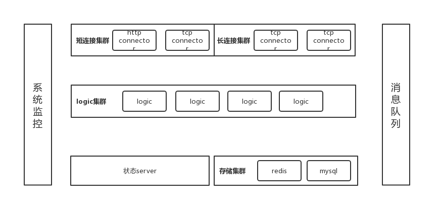
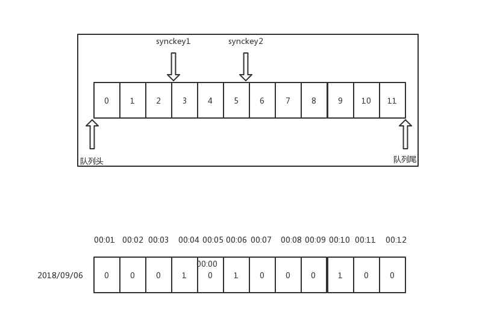

### 背景
---
希望尝试实现一个同时支持web，长链接客户端的IM系统。系统的设计目标如下：
* 优秀的水平扩展能力
* 适应移动网络的弱网络环境
* 必要的容灾设计

### 总体架构设计
---
总体架构图如下：

下面来重点描述下架构中的一些关键点

#### 连接层

连接层分为短连接和长连接，各自负责不同的功能，配合完成这个业务场景：

  短连接：

  1.  用于用户登陆退出，初始化状态数据
  2.  用于长连接集群的负载均衡和故障转移(客户端通过询问短连接集群自己的connector)
  3.  用于用户好友列表，用户消息的同步
  4.  未来可能用于多媒体数据的上传下载

长连接：

  1. 用户状态变更推送(好友添加，新消息到达...)
  2. 用户消息发送

#### 状态server

 状态server统一负责用户session的管理，包括用户登录态维护，用户长连接节点管理，用户当前终端信息及多终端之间的消息同步和复制

 状态server使用rpc同步调用方式对外暴露接口，目前使用redis作为底层存储介质

 #### 监控

 系统各个服务需要和监控服务维持心跳并上报健康数据，监控系统需要自动摘除故障节点，并作为仲裁角色辅助进行主备切换的选举工作

 监控系统需要对外提供http查询接口和常用数据的可视化界面

 ### 业务场景及实现方案详解
---

#### 登陆
登陆通过http短连接完成，主要步骤：
  1. 校验用户身份，发放登陆令牌
  2. 初始化状态信息，包括建立状态队列，初始化syncKey
  3. 如果是长连接客户端为用户分配connector

状态队列数据结构：
  按照不同业务划分为不同状态队列,如下图所示

  

    1. 服务器为每个登陆用户维护增量消息同步队列，新消息到达依次进入队尾
    2. 队列维护两个指针分为当前同步key synckey1和下一个同步key snckey2.客户端通过这两个key增量同步客户端信息
    3. 具体同步方案见下文发送消息和接受消息

#### 离线消息

发送给离线用户(未上线，断线)持久化到数据库中，在用户下次登陆时读出到状态队列中。

#### 发送消息

用户发送文字消息到server中后，server需要给客户端回复ack(客户端长连接需要和客户端维护squenceid)
到达服务器的消息通过对应的逻辑服务器处理后将消息投递到目标用户的队列中，并且给目标用户推送通知，目标客户端使用同步请求来拉取消息同时兼具ack效果[如果服务器在一个timeout内未收到客户端的同步请求，则重新推送通知]

#### 接收消息

消息接收采取增量同步方式，推送消息通知，客户端主动同步消息内容(服务器端不推送消息内容)

#### 断线重连

   1. 用户因网络故障和connector失去心跳时，客户端尝试重试连接
   2. 当用户重连失败次数超过阀值重新通过http连接集群请求切换connector(故障转移)
   3. 当服务器因特殊原因(比如升级connector)，可通过推送指令要求客户端连接到其他connector

#### 多端同步
   暂略

 ### 通信协议设计
---

 #### http短连接协议

 #### 长连接协议

 #### 消息协议

 #### 监控系统协议

 ### 难点突破
---
